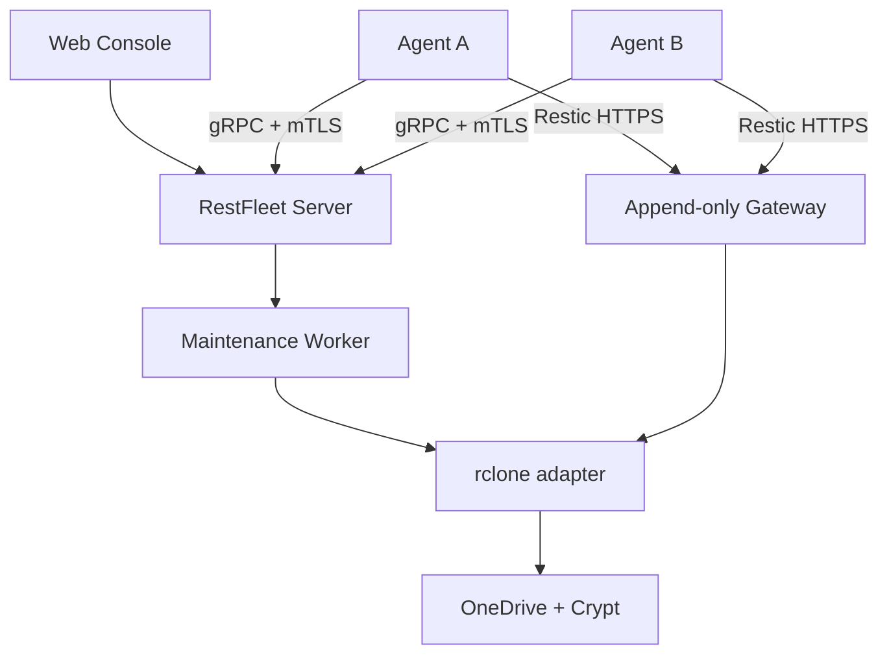

# 01 — 系统架构

## 1. 架构目标

RestFleet 将系统拆成三个逻辑平面：

1. **Control Plane**：身份、配置、任务、状态、UI、审计；
2. **Data Plane**：Agent 的 Restic 流量经 append-only Repository Gateway 到 rclone/OneDrive；
3. **Maintenance Plane**：中心使用完整权限执行快照查询、下载、Retention 和维护。

三个平面可以部署在同一中心节点，但凭据、监听面与代码模块必须保持隔离。

## 2. 总体拓扑



Control channel 只承载小型控制消息、状态和日志。备份文件内容只能走 Data Plane。单文件下载由 Maintenance Worker 从仓库读取并作为用户请求流出，不经过 Agent channel。

## 3. V1 进程模型

### 3.1 中心

V1 采用模块化单体：

```text
restfleet-server
├── HTTP API / Web assets
├── Auth / Session
├── Agent gRPC Gateway
├── Enrollment / Internal CA
├── Desired State Reconciler
├── Durable Job Dispatcher
├── Repository Manager
├── Maintenance Worker
├── Snapshot Indexer
├── Credential Manager
├── Notification Worker
└── Audit Writer
```

部署时另包含：

```text
postgres
rclone-gateway
reverse-proxy (existing Traefik/Caddy/Nginx is allowed)
```

模块可在 V2 拆进不同进程，但 V1 不引入网络化内部微服务。

### 3.2 Agent

```text
restfleet-agent
├── Enrollment client
├── mTLS connection manager
├── Desired-state store
├── Local scheduler
├── Job executor
├── Restic adapter
├── Local hook allowlist
├── Log/progress streamer
└── Health reporter
```

Agent 只依赖自身二进制与可执行的 Restic。Native 安装推荐由 systemd 管理。Docker image 内置已锁定的 Restic 版本。

## 4. 组件职责

| 组件 | 负责 | 不负责 |
|---|---|---|
| HTTP API | 用户认证、CRUD、查询、危险操作入口 | 直接执行长任务 |
| Agent Gateway | mTLS、连接、心跳、下发任务 | 传输备份数据 |
| Reconciler | Desired revision 与 Agent accepted revision 收敛 | 每次定时触发备份 |
| Job Dispatcher | Durable jobs、租约、重试、幂等 | 仓库命令实现 |
| Repository Manager | Repo 生命周期、网关身份、密码和绑定 | Host 本地文件读取 |
| Maintenance Worker | snapshots/ls/dump/check/forget/prune/unlock | Agent backup |
| Credential Manager | rclone secret、materialization、token refresh 持久化 | 向 Agent 下发 rclone secret |
| Notification Worker | Gotify/Webhook 投递、去重和重试 | 改变 Operation 结果 |
| Agent Scheduler | 离线本地调度、misfire/concurrency 规则 | Retention 与 prune |
| Agent Restic Adapter | 安全构建 argv、解析 JSONL、取消进程 | shell 命令拼接 |

## 5. 数据流

### 5.1 计划下发

1. 管理员修改 Plan；
2. Server 在事务中写入新 revision、AuditEvent 与 OutboxEvent；
3. Reconciler 生成 Host 的完整 DesiredState；
4. 在线 Agent 收到 revision，验证后原子保存；
5. Agent 回 `ConfigAccepted` 或结构化 `ConfigRejected`；
6. Server 记录 accepted revision，不把“已发送”当作“已生效”。

### 5.2 计划备份

1. Agent 本地 scheduler 根据 timezone、jitter 与 misfire policy 创建 job；
2. Agent 取得 Plan 本地执行锁；
3. 可选执行本地 allowlisted pre-hook；
4. Agent 运行 Restic，直接连接 Repository Gateway；
5. 解析 JSONL 并上报进度；网络断开时在本地缓冲摘要和有限日志；
6. 结束后保存 Operation result，并在重连后幂等补报；
7. Server 刷新 Snapshot metadata，更新 Backup Health；
8. 触发通知规则。

### 5.3 中心维护

1. Scheduler 或管理员创建 Maintenance Operation；
2. Worker 获取 repository-scoped advisory lock 与 DB lease；
3. 确认不存在活跃 backup lease；
4. 通过中心 rclone adapter 执行 Restic；
5. 结构化解析结果，更新 snapshots/stats；
6. 写 AuditEvent 并发布通知。

`forget` 与 `prune` 必须拆成可审计的预览和执行阶段，不能由 API handler 同步直接执行。

## 6. Repository Gateway

V1 默认使用 `rclone serve restic`：

- 绑定内部地址，由 reverse proxy 提供外部 TLS；也可让 rclone 直接提供 TLS；
- 必须启用 `--append-only`；
- 必须启用 `--private-repos` 或实现等价且测试覆盖的 repo path 隔离；
- 每个 Agent 使用独立用户名与高熵密码；
- htpasswd 可热更新，但轮换必须支持短暂双凭据过渡或原子替换；
- public gateway 不得暴露 rclone RC、配置文件或管理接口；
- 最低 TLS 1.2，推荐 1.3；
- 超时必须足以容纳大文件传输，同时配置请求大小、连接与速率限制。

公开 URL 示例：

```text
rest:https://<agent-user>:<gateway-secret>@backup.example.com/restic/<agent-user>/<repo-id>/
```

Server 下发时 MUST 分开传 endpoint、username 与 secret，不持久化带凭据 URL，不在日志中输出拼接后的 URL。

### 6.1 管理访问

V1 默认不暴露第二个公网 full-access REST gateway。Maintenance Worker 在中心内部通过受限 Unix socket、rclone backend/stdio 或仅内部网络的管理 listener 访问同一 remote。中心初始化采用 ADR-0010 的私有 Unix socket：Server MUST 分别拥有并回收 Restic/rclone 进程；目录权限为 0700、socket 为 0600，MUST NOT 绑定 TCP 或映射到 Agent/反向代理。

若使用网络管理 listener：

- 只能存在于不可路由的 internal network；
- 必须使用独立身份与 TLS/mTLS；
- reverse proxy 不得将其映射到公网；
- 健康检查不得包含凭据；
- 部署验收必须证明外部不可达。

## 7. 存储布局

默认远端布局：

```text
<rclone-crypt-remote>:restfleet/
└── agents/
    └── <gateway-username>/
        └── <repository-uuid>/
            ├── config
            ├── data/
            ├── index/
            ├── keys/
            ├── locks/
            └── snapshots/
```

路径使用不可变 UUID，不使用可修改 hostname。显示名变化不得导致仓库移动。

## 8. PostgreSQL 与队列

PostgreSQL 是以下内容的唯一权威来源：

- desired configuration；
- Agent identity/status；
- Repository/credential metadata；
- Operations 与状态机；
- Snapshot index/cache；
- Notification delivery；
- Audit events。

V1 不使用 Redis。Job Dispatcher 使用 `jobs` 表、`FOR UPDATE SKIP LOCKED`、租约时间和 attempt count。事务性业务变更通过 `outbox_events` 保证后续处理不会因进程崩溃丢失。

## 9. 可用性规则

### 中心离线

- Agent 继续执行已接受的 enabled Plans；
- 本地保留 operation summaries 与限额日志；
- 不能创建新配置或远程 Backup Now；
- Data Plane gateway 若与中心同机也离线，则备份会失败并按 Plan retry policy 处理；
- 恢复后 Agent 先补报结果，再进行配置 reconciliation。

“控制面离线不影响调度”不等于“中心整机离线仍能写入同机网关”。这两个故障域必须在 UI 与文档中区分。

### 数据库离线

- Server readiness 失败；
- 已建立 Agent stream 不接收新的远程任务；
- 不执行无法审计的维护操作；
- gateway 可独立继续接受备份流量。

### OneDrive/rclone 故障

- gateway 失败不改变已接受 Plan；
- Agent 按指数退避重试，并受 retry deadline 限制；
- credential health 进入 DEGRADED/EXPIRED；
- 告警按 fingerprint 去重。

## 10. 并发与锁

- 同一 Plan 同时最多一个 Backup Operation；
- 同一 Host 默认最多一个 I/O-heavy operation；
- 同一 Repository 可接受多个正常 backup，但 V1 默认一 Host 一 Repo；
- `forget`、`prune`、`check`、`unlock` 每 Repo 串行；
- destructive maintenance 开始前等待 active backup lease 释放；
- 所有 lease 可过期并续租，进程崩溃后可恢复；
- Restic exit code `11` 作为 lock contention 分类，而非 generic failure。

## 11. 技术版本策略

- CI 将 Restic 与 rclone 锁定为具体版本和校验和/镜像 digest；
- V1 以 Restic 0.19.x 的 JSON 契约为实现基线，同时容忍新增 JSON 字段与 message type；
- 未知 Restic exit code 必须按失败处理；
- Agent/Server 协议至少支持 N 与 N-1 minor 版本滚动升级；
- 不使用生产 `latest` image tag。

## 12. 扩展边界

下列接口需要保留适配层，但 V1 不实现额外后端：

- `StorageBackend`：V1 只有 rclone/OneDrive；
- `RepositoryGateway`：V1 只有 rclone serve restic；
- `NotificationSender`：Gotify、Webhook；
- `SecretStore`：V1 本地 master key + PostgreSQL envelope encryption；未来可接 Vault/KMS；
- `AgentTransport`：V1 只有 gRPC/mTLS。
