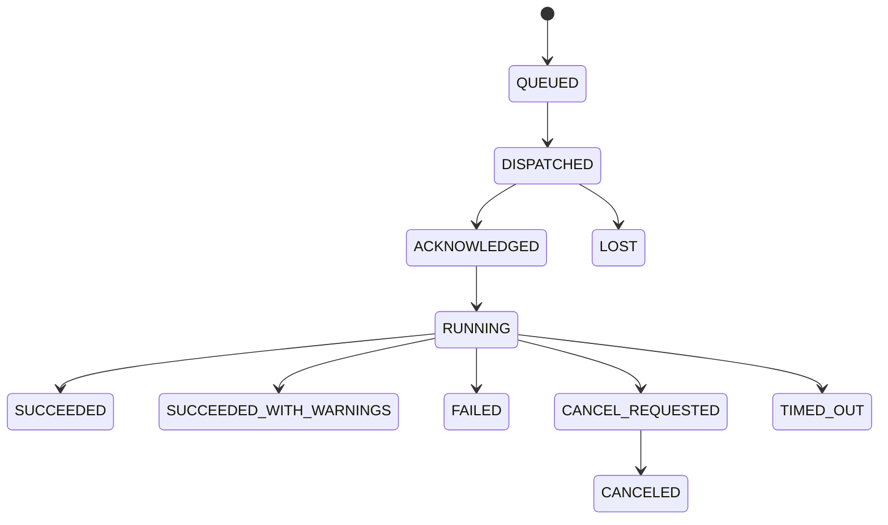

# 03 — 领域模型

## 1. 建模原则

- 配置对象使用 `desired state + revision`；Agent 回报 `accepted revision`。
- 可变显示名称与不可变标识分离。
- Repository 与 Plan 分离；Template 是复用配置，Plan 是绑定后的执行实例。
- Operation 是不可复用的一次执行，不承担长期配置职责。
- Snapshot 元数据来自 Restic，是仓库事实的本地索引，不是唯一真相。
- Secret 只以 `SecretRef` 和 revision 出现在普通领域对象中。
- 删除业务对象优先 soft delete/archive；仓库对象删除只能经 Maintenance Operation。

## 2. 标识与通用字段

所有 RestFleet 公共对象 ID 使用 UUIDv7，小写标准字符串。Restic snapshot ID 保持完整 64 位 SHA-256 hex。

通用字段：

```text
id              UUIDv7
created_at      timestamptz UTC
updated_at      timestamptz UTC
revision        bigint, starts at 1
archived_at     timestamptz nullable
```

用户可编辑资源的 PATCH/PUT 必须比较 `revision`。API 使用 ETag `"<revision>"` 与 `If-Match` 防止静默覆盖。

## 3. User 与 Session

### User

```text
id
username
display_name
password_hash
role            ADMIN | VIEWER
status          ACTIVE | DISABLED
last_login_at
created_at / updated_at
```

V1 只要求一个或多个 ADMIN；VIEWER 可延后实现，但 Schema 保留。

### Session

```text
id
user_id
token_hash
csrf_secret_hash
created_at
last_seen_at
idle_expires_at
absolute_expires_at
revoked_at
ip_hash
user_agent_summary
```

## 4. Host 与 Agent

### Host

代表一台被管理的逻辑主机：

```text
id
display_name
description
labels          map<string,string>
timezone        IANA name
status          PENDING | ACTIVE | DISABLED | REVOKED
created_at / updated_at / revision
```

hostname 由 Agent inventory 上报，不用作 ID。Host 可在 Agent 重装时保留，旧 Agent identity 被撤销后绑定新 Agent。

### Agent

代表一次安装身份：

```text
id
host_id
install_id       random local UUID, unique
public_key_fingerprint
certificate_serial
certificate_not_after
status           ACTIVE | REVOKED (identity lifecycle)
health           ONLINE | DEGRADED | OFFLINE | REVOKED (derived, not persisted)
version
protocol_version
os / arch
hostname
boot_id
restic_version
uptime_seconds
state_free_bytes
clock_offset_ms
last_seen_at
last_connected_at
last_ip          optional, access controlled
desired_revision
accepted_revision
heartbeat_error_code
config_error_code
config_error_field
created_at / updated_at
```

一个 Host 同时只能有一个未撤销的 Agent identity。`status` 只用于授权生命周期；在线、异常和离线由 `last_seen_at` 与诊断状态按 ADR-0006 推导。替换 Agent 必须显式 revoke 旧 identity。

### AgentInventory

最近一次上报快照：

```text
agent_id
captured_at
kernel
os_release
cpu_arch
agent_version
restic_version
uptime_seconds
state_free_bytes
clock_offset_ms
containerized
available_bytes_by_mount (limited)
clock_offset_ms
capabilities[]
```

不得默认采集进程列表、环境变量、用户列表或文件清单。

## 5. EnrollmentToken 与 AgentCertificate

### EnrollmentToken

```text
id
host_id
token_hash
token_fingerprint
expires_at
created_by
created_at
used_at
used_by_agent_id
revoked_at
```

状态由时间与字段推导：ACTIVE、USED、EXPIRED、REVOKED。

### AgentCertificate

```text
id
agent_id
serial_number
public_key_fingerprint
not_before / not_after
issued_at
revoked_at
revocation_reason
superseded_by
```

证书私钥不进入模型，因为只存在 Agent 本地。

## 6. StorageCredential

代表中心存储后端的 secret bundle：

```text
id
name
provider             RCLONE_ONEDRIVE
remote_name
status               UNTESTED | HEALTHY | DEGRADED | EXPIRED | DISABLED
secret_ref
secret_revision
provider_metadata    non-secret JSON
last_tested_at
last_test_result
last_refreshed_at
created_at / updated_at / revision
```

`provider_metadata` 可以含 drive type、drive ID 的 hash/后四位、region，但不得含 token/client_secret/crypt password。

## 7. Repository

```text
id
name
host_id              V1 required and unique for active repo
storage_credential_id
backend_path          generated immutable relative path
gateway_username      generated immutable
gateway_secret_ref
gateway_secret_revision
restic_secret_ref
restic_secret_revision
format_version
status                PROVISIONING | READY | DEGRADED | LOCKED | DISABLED | ERROR
maintenance_policy_id
last_indexed_at
last_check_at / last_check_status
last_prune_at / last_prune_status
snapshot_count
restore_size_bytes
raw_data_bytes
provider_used_bytes   nullable
created_at / updated_at / revision
```

V1 不允许一个 Host 同时绑定多个 active Repository，也不允许多个 Host 绑定同一 Repository。Schema 可以为 V2 预留 join table，但 API 必须拒绝 Shared Repo。

### RepositoryCredentialRevision

记录向 Agent 下发的版本，而非明文：

```text
id
repository_id
kind                  GATEWAY | RESTIC_KEY
revision
secret_ref
valid_from
retire_after
retired_at
created_at
```

## 8. RetentionPolicy 与 MaintenancePolicy

### RetentionPolicy

```text
id
name
keep_last
keep_hourly
keep_daily
keep_weekly
keep_monthly
keep_yearly
keep_within
minimum_snapshots     default 1
created_at / updated_at / revision
```

至少一个 keep 条件必须存在；`minimum_snapshots >= 1`。V1 不允许 keep unlimited 与危险空策略产生模糊行为。

### MaintenancePolicy

```text
id
name
index_cron / timezone
check_cron / check_read_data_subset
retention_cron
prune_cron
max_duration
retry_policy
created_at / updated_at / revision
```

Retention 属于 Plan，但由 Repository 的维护 worker 汇总并按 Plan tag 分别执行。Prune 属于 Repository，因为它回收整个 Repository 的无引用数据。

## 9. BackupTemplate

可复用配置，不直接执行：

```text
id
name
description
paths[]
exclude_patterns[]
exclude_caches
one_file_system
schedule_cron
schedule_timezone
jitter_seconds
misfire_grace_seconds
retry_policy
retention_policy_id
pre_hook_ids[]
post_hook_ids[]
resource_limits
enabled_by_default
created_at / updated_at / revision
```

Template 更新不应隐式立即改变所有运行中 Plan。更新后产生新 Template revision，各 Plan 显示 `UPDATE_AVAILABLE`；管理员可批量 apply。这样避免一次模板误改同时破坏所有主机。

## 10. Plan

Plan 是 Host、Repository 与某个 Template revision 的绑定：

```text
id
name
host_id
agent_id
repository_id
template_id
template_revision
effective_config       normalized JSON snapshot
overrides              JSON Merge Patch subset
status                 DRAFT | PENDING_APPLY | ACTIVE | PAUSED | INVALID | ARCHIVED
desired_revision
accepted_revision
last_scheduled_at
next_run_at
last_success_at
last_operation_id
backup_health
created_at / updated_at
```

`effective_config` 在 Server 生成并存档，Agent 不负责动态合并 Template。历史 Operation 必须引用当时的 Plan revision 与 config hash。

### Plan tags

每次 backup 自动添加：

```text
restfleet:managed
restfleet:host:<host-uuid>
restfleet:plan:<plan-uuid>
```

其中用于 Retention 的最低限定是 `restfleet:managed` + `restfleet:plan:<uuid>`。Plan revision 记录在 Operation 与本地 Snapshot 索引中，不写入 Restic tag；否则使用 `--group-by tags` 时每次配置 revision 都会形成新的 snapshot group，破坏 parent 选择和 retention 语义。用户 tags 不能使用 `restfleet:` namespace。

## 11. Operation

### OperationType

```text
BACKUP
RESTORE
SNAPSHOT_INDEX
DOWNLOAD
CHECK
FORGET_PREVIEW
FORGET
PRUNE
UNLOCK
CREDENTIAL_TEST
CREDENTIAL_ROTATE
HOOK
```

### OperationStatus

```text
QUEUED
DISPATCHED
ACKNOWLEDGED
RUNNING
SUCCEEDED
SUCCEEDED_WITH_WARNINGS
FAILED
CANCEL_REQUESTED
CANCELED
TIMED_OUT
LOST
REJECTED
```

终态：SUCCEEDED、SUCCEEDED_WITH_WARNINGS、FAILED、CANCELED、TIMED_OUT、LOST、REJECTED。

### Operation 字段

```text
id
type / status
source              SCHEDULE | USER | RETRY | MAINTENANCE
host_id / agent_id / repository_id / plan_id nullable
plan_revision
config_hash
requested_by_user_id
parent_operation_id
idempotency_key
attempt
created_at
dispatch_deadline
dispatched_at / acknowledged_at / started_at / finished_at
lease_owner / lease_expires_at
exit_code
error_code
error_summary
statistics JSON
snapshot_id nullable
cancel_requested_at
```

### 状态机



允许的额外路径：QUEUED→REJECTED、QUEUED→CANCELED、DISPATCHED→FAILED。任何终态不能回到非终态；Retry 创建新 Operation 并设置 parent，不重开旧记录。

## 12. OperationLogChunk

```text
operation_id
sequence
stream              STDOUT | STDERR | SYSTEM
captured_at
encoding            UTF8 | BASE64
redacted_content
byte_count
truncated
```

单 Operation V1 默认最多保存 10 MiB 日志；超限继续保留 structured progress/summary，并写一条 truncated marker。

## 13. Snapshot

```text
id                    Restic full snapshot ID
repository_id
host_id
plan_id nullable       from managed tag
plan_revision nullable
time
parent_id
tree_id
hostname
username
paths[]
excludes[]
tags[]
program_version
summary JSON
managed
discovered_at
last_seen_at
missing_at nullable
```

Repository re-index 时未看到的 Snapshot 先标记 `missing_at`，连续两次完整成功索引均缺失后再隐藏；避免临时后端问题造成 UI 闪烁。

### SnapshotEntryCache

快照文件树不是全量权威索引。V1 按需运行 `restic ls --json`，把结果以 snapshot/tree ID 和 cache version 暂存：

```text
snapshot_id
path
parent_path
name
type
size
mode / permissions
uid / gid
mtime
cached_at
expires_at
```

缓存可清除，不参与恢复正确性。

## 14. RestoreJob

```text
id
operation_id
snapshot_id
source_paths[]
target_host_id
target_mode          AGENT_STAGING
target_subdirectory
overwrite_policy     NEVER | IF_NEWER (V1 only NEVER)
requested_by
reason
confirmed_at
staging_path
result_summary
created_at
```

V1 只允许 `AGENT_STAGING + NEVER`。未来模式通过新 enum 值和 capability negotiation 引入。

## 15. HookDefinition

中心仅保存可引用标识和期望，不保存命令：

```text
id
hook_key             e.g. postgres-dump
display_name
phase                PRE_BACKUP | POST_BACKUP | PRE_RESTORE | POST_RESTORE
timeout_seconds
failure_policy       ABORT | WARN
required_capability
```

Agent inventory 报告本地可用 hook keys。Plan 若引用 Agent 未声明的 key，状态为 INVALID。

## 16. Notification 与 Audit

### NotificationChannel

```text
id
type                 GOTIFY | WEBHOOK
name
endpoint
secret_ref
enabled
event_filters[]
last_tested_at / status
```

### NotificationDelivery

```text
id
channel_id
event_type
event_id
fingerprint
status               PENDING | SENT | FAILED | SUPPRESSED
attempt
next_attempt_at
response_code
created_at / sent_at
```

### AuditEvent

```text
id
occurred_at
actor_type           USER | AGENT | SYSTEM
actor_id
action
resource_type / resource_id
request_id
source_ip_hash
result               SUCCESS | DENIED | FAILURE
reason_code
changes JSON         redacted
previous_hash
event_hash
```

## 17. 生命周期规则

- Host archive 前必须 pause 所有 Plan；Repository 不自动删除。
- Agent revoke 不删除 Host、Plan、Operation 或 Snapshot。
- Template archive 不影响已绑定 revision，但禁止新绑定。
- Plan archive 不触发 snapshot forget；Retention 停止，管理员需显式决定历史保留。
- Repository disable 阻止新 backup/maintenance，但保留 metadata。
- 删除 StorageCredential 前必须不存在 active Repository 引用。
- Snapshot 只能通过 Repository 重新索引或 maintenance 结果改变可见性。
