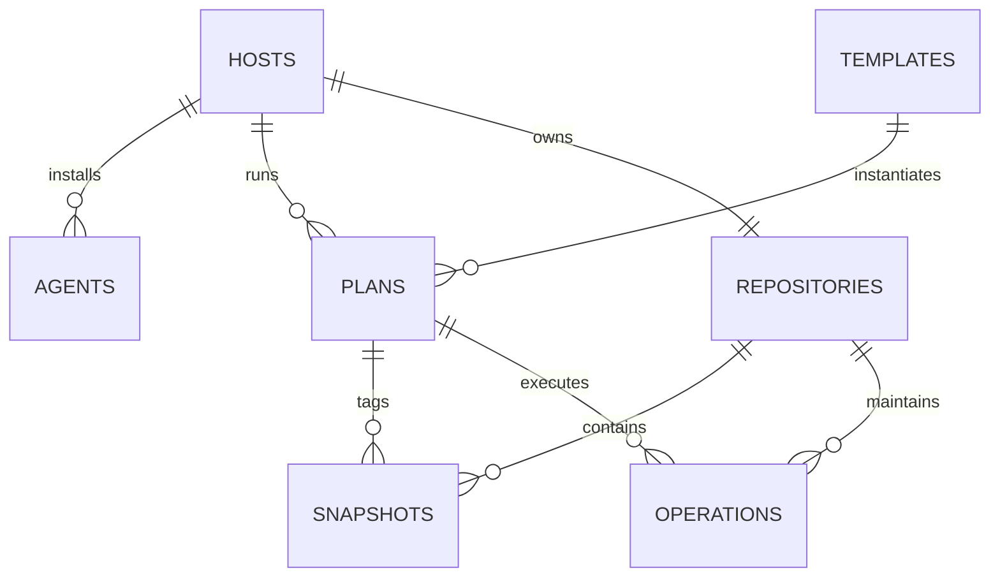

# 07 — PostgreSQL 数据库规范

## 1. 选择 PostgreSQL

V1 使用 PostgreSQL，而非生产 SQLite，原因：

- Agent 连接、Operation、日志、通知与维护任务存在并发写入；
- 需要 row lock、`SKIP LOCKED`、advisory lock、事务 outbox 和可靠租约；
- 需要 JSONB、partial index、约束和后续扩展能力；
- 中心 Docker Compose 增加一个数据库服务的成本可控；
- 避免 V1 后期从 SQLite 迁移关键状态机。

Agent 本地状态仍使用 bbolt，与控制面数据库选择无关。

## 2. 通用约定

- PostgreSQL 16+；
- 所有时间 `timestamptz`，应用写 UTC；
- 公共 ID `uuid`，应用生成 UUIDv7；
- enum 优先 `text + CHECK` 或 lookup constraints，便于滚动迁移；
- 金额/字节/计数使用 `bigint` 并检查非负；
- secret plaintext 禁止入库；
- migration 只前向自动执行；破坏性 rollback 使用修复迁移；
- 每次 migration 在 CI 从空库和上一 release snapshot 测试；
- SQL query 使用参数绑定。

## 3. 核心关系



## 4. 表清单

### 4.1 Identity/Auth

- `users`
- `sessions`
- `bootstrap_state`
- `enrollment_tokens`
- `agent_certificates`

### 4.2 Inventory/Config

- `hosts`
- `agents`
- `agent_inventories`
- `storage_credentials`
- `secrets`
- `repositories`
- `repository_credential_revisions`
- `retention_policies`
- `maintenance_policies`
- `templates`
- `template_revisions`
- `plans`
- `plan_revisions`

### 4.3 Execution/Data index

- `jobs`
- `operations`
- `operation_events`
- `operation_log_chunks`
- `snapshots`
- `snapshot_entry_cache`
- `restore_previews`
- `restore_jobs`
- `maintenance_previews`
- `repository_leases`

### 4.4 Delivery/Audit

- `outbox_events`
- `notification_channels`
- `notification_deliveries`
- `audit_events`
- `idempotency_records`

## 5. 关键表定义（逻辑）

### 5.1 hosts

```sql
create table hosts (
  id uuid primary key,
  display_name text not null,
  description text not null default '',
  labels jsonb not null default '{}',
  timezone text not null,
  status text not null,
  revision bigint not null default 1,
  created_at timestamptz not null,
  updated_at timestamptz not null,
  archived_at timestamptz,
  check (status in ('PENDING','ACTIVE','DISABLED','REVOKED')),
  check (revision > 0)
);
```

`display_name` 在 active rows 中大小写不敏感唯一；可使用 functional partial unique index。

### 5.2 agents

```sql
create table agents (
  id uuid primary key,
  host_id uuid not null references hosts(id),
  install_id uuid not null unique,
  public_key_fingerprint text not null unique,
  certificate_serial text not null unique,
  certificate_not_after timestamptz not null,
  status text not null,
  version text not null,
  protocol_version text not null,
  os text not null,
  arch text not null,
  hostname text not null,
  boot_id text,
  restic_version text,
  uptime_seconds bigint not null default 0,
  state_free_bytes bigint not null default 0,
  clock_offset_ms bigint not null default 0,
  last_seen_at timestamptz,
  last_connected_at timestamptz,
  desired_revision bigint not null default 0,
  accepted_revision bigint not null default 0,
  heartbeat_error_code text not null default '',
  config_error_code text not null default '',
  config_error_field text not null default '',
  created_at timestamptz not null,
  updated_at timestamptz not null,
  check (status in ('ACTIVE','REVOKED')),
  check (accepted_revision <= desired_revision)
);
```

Partial unique index：每个 Host 最多一个 `status = 'ACTIVE'` Agent。运行 health 不持久化，并按 ADR-0006 在读取时推导。

`agent_desired_states` MUST 以 `(agent_id, revision)` 为主键保存完整规范化 `config_json` 与 `config_hash`。创建或改变 desired revision 的事务 MUST 同时写 `outbox_events`。

`agent_inventories` MUST 保存不可变快照，并在 `(agent_id, captured_at desc)` 上建立索引。清单字段和 JSON map/array MUST 有长度、类型和枚举边界；不得包含环境变量、用户列表、进程列表或文件名。

### 5.3 secrets

```sql
create table secrets (
  id uuid primary key,
  secret_type text not null,
  ciphertext bytea not null,
  nonce bytea not null,
  wrapped_dek bytea not null,
  wrap_nonce bytea not null,
  kek_version integer not null,
  aad_version integer not null,
  created_at timestamptz not null,
  rotated_at timestamptz,
  destroyed_at timestamptz,
  check (octet_length(nonce) = 12),
  check (octet_length(wrap_nonce) = 12)
);
```

普通 repository/API query 不 join/decrypt secrets。Secret access 通过独立 store interface，并生成 audit/security metric。

### 5.4 repositories

```sql
create table repositories (
  id uuid primary key,
  host_id uuid not null references hosts(id),
  storage_credential_id uuid not null references storage_credentials(id),
  name text not null,
  backend_path text not null unique,
  gateway_username text not null unique,
  gateway_secret_ref uuid not null references secrets(id),
  restic_secret_ref uuid not null references secrets(id),
  format_version integer,
  status text not null,
  maintenance_policy_id uuid references maintenance_policies(id),
  snapshot_count bigint not null default 0,
  restore_size_bytes bigint,
  raw_data_bytes bigint,
  provider_used_bytes bigint,
  last_indexed_at timestamptz,
  last_check_at timestamptz,
  last_prune_at timestamptz,
  revision bigint not null default 1,
  created_at timestamptz not null,
  updated_at timestamptz not null,
  archived_at timestamptz,
  check (status in ('PROVISIONING','READY','DEGRADED','LOCKED','DISABLED','ERROR')),
  check (snapshot_count >= 0)
);
```

Partial unique index：每 Host 仅一个未 archive Repository。V2 共享 Repo 需要显式迁移，不提前削弱 V1 约束。

### 5.5 template_revisions / plan_revisions

每次变更保存不可变 snapshot：

```text
template_revisions(template_id, revision, config_json, config_hash, created_by, created_at)
plan_revisions(plan_id, revision, effective_config_json, config_hash, created_by, created_at)
```

Primary key 为 `(id, revision)`；`config_hash` 使用 canonical JSON SHA-256。`plans` 保存 current desired/accepted revision 和当前索引字段。

### 5.6 plans

约束：

- `host_id`、`repository_id`、`agent_id` 必须在应用事务中验证同一 Host；
- `desired_revision >= accepted_revision`；
- enabled plan 必须有完整 effective config；
- `(host_id, lower(name))` 对 active plans 唯一；
- `backup_health` 与 `status` 使用 CHECK；
- archived plan 不允许 ACTIVE。

### 5.7 operations

```sql
create table operations (
  id uuid primary key,
  type text not null,
  status text not null,
  source text not null,
  host_id uuid references hosts(id),
  agent_id uuid references agents(id),
  repository_id uuid references repositories(id),
  plan_id uuid references plans(id),
  plan_revision bigint,
  config_hash text,
  requested_by_user_id uuid references users(id),
  parent_operation_id uuid references operations(id),
  idempotency_key text,
  attempt integer not null default 1,
  created_at timestamptz not null,
  dispatch_deadline timestamptz,
  dispatched_at timestamptz,
  acknowledged_at timestamptz,
  started_at timestamptz,
  finished_at timestamptz,
  lease_owner text,
  lease_expires_at timestamptz,
  exit_code integer,
  error_code text,
  error_summary text,
  statistics jsonb not null default '{}',
  snapshot_id text,
  cancel_requested_at timestamptz,
  check (attempt > 0),
  check (snapshot_id is null or snapshot_id ~ '^[0-9a-f]{64}$')
);
```

状态转换只能通过 repository method：

```text
transition_operation(id, expected_statuses, new_status, metadata)
```

它在事务中 row lock、验证允许边、写 operation_event 与 outbox。禁止通用 PATCH status。

索引：

- `(status, created_at)` 对未终态；
- `(agent_id, status)`；
- `(repository_id, created_at desc)`；
- `(plan_id, created_at desc)`；
- `(created_at desc, id desc)` 用于 cursor；
- source/idempotency unique partial indexes。

### 5.8 jobs

```text
id
operation_id unique
queue
payload jsonb
status READY | LEASED | DONE | DEAD
available_at
lease_owner
lease_expires_at
attempt
max_attempts
last_error_code
created_at / updated_at
```

Worker claim：

```sql
select ...
from jobs
where status = 'READY' and available_at <= now()
order by available_at, id
for update skip locked
limit $n;
```

同一事务更新 LEASED。Worker 定期续租；过期 lease 可重新 claim。Job handler 必须幂等。

### 5.9 operation_log_chunks

Primary key `(operation_id, sequence)`，保证重复上报幂等。Content 使用 `bytea` 或 text；只存 redacted 内容。保留 byte_count/truncated。大规模部署可按月 partition，V1 可暂不 partition 但 Schema/migration 测试需评估。

### 5.10 snapshots

Primary key `(repository_id, id)`，其中 id 是完整 snapshot SHA。索引：

- `(repository_id, time desc, id)`；
- `(host_id, time desc)`；
- `(plan_id, time desc)`；
- GIN tags 仅在查询需要时增加；
- `missing_at` partial index。

Snapshot 同步使用 staging table 或 transaction upsert；只有完整成功的 `restic snapshots --json` 才更新 missing markers。

### 5.11 snapshot_entry_cache

Cache table 可以删除/rebuild。Primary key 包含 repository、snapshot、cache generation、path。必须有 `expires_at` 索引与总量清理。不要让 cache FK cascade 意外触发 repository object 删除；它仅是 DB rows。

### 5.12 audit_events

Append-only：应用 DB role 不授予 UPDATE/DELETE。字段见领域规范。

Hash chain：

```text
event_hash = SHA-256(canonical_event_without_hash || previous_hash)
```

Hash chain 用于发现 DB 内篡改，不替代外部 WORM/日志导出。并发写通过单独 audit sequence/row lock 或分 shard chain 实现；V1 可用单链。

## 6. Transactional Outbox

任何需要异步后续处理的事务同时写 `outbox_events`：

```text
id
event_type
aggregate_type / aggregate_id
payload jsonb (redacted)
created_at
available_at
published_at
attempt
lease_owner / lease_expires_at
```

示例：Plan revision + `DESIRED_STATE_CHANGED` outbox 必须同一事务。Publisher 至少一次处理，消费者幂等。

## 7. Idempotency Records

```text
scope_hash
idempotency_key_hash
request_hash
response_status
resource_type / resource_id
created_at / expires_at
```

Primary key `(scope_hash, idempotency_key_hash)`。不保存原始 key。并发首次请求用 unique constraint 决定 winner。

## 8. Leases 与 Advisory Locks

- durable worker/job lease 存表；
- repository destructive operation 同时使用 transaction advisory lock，key 从 repo UUID 稳定派生；
- Agent backup active lease 由 heartbeat/operation 更新；
- maintenance 开始前检查 active leases，并在一个 transaction 中取得 maintenance lease；
- advisory lock 只作为进程并发保护，业务可见状态仍存表。

## 9. Secret 与权限分离

建议数据库角色：

- `restfleet_app`：普通业务表、secret ciphertext；不能读取 migration metadata 之外的管理对象；
- `restfleet_migrator`：schema DDL，仅启动 migration job 使用；
- `restfleet_audit_writer`：audit INSERT/SELECT，无 UPDATE/DELETE；
- 运维只读角色可选。

即使 V1 单进程共用连接池，迁移与 runtime credential 必须分开。

## 10. 数据保留

- Operations metadata：默认无限或管理员策略；
- Raw logs：默认 90 天，终态 summary 永久；
- Agent inventory history：默认 30 天，保留最新；
- Notification deliveries：90 天；
- Sessions：过期后 30 天清理；
- Token hashes：used/expired 后 30 天保留审计关联；
- AuditEvents：V1 不自动删除；
- Snapshot cache：TTL/LRU，可随时重建。

这些 DB 保留策略与 Restic Snapshot Retention 完全分开。

## 11. 备份控制面数据库

RestFleet 管理自己的备份不能形成循环依赖：

- PostgreSQL 使用 `pg_dump`/volume snapshot 的外部管理方案；
- master key 必须与 DB backup 分开安全备份；
- 丢失 master key 会使 rclone/Repo/CA secret 不可恢复；
- 恢复演练需同时验证 DB、master key、CA 与 rclone credential；
- 不允许把 RestFleet 唯一控制面备份只存入一个无法在 RestFleet 外访问的 Repository。

## 12. Migration 安全

- Server 启动时默认检查 migration，不在多个副本并发跑 DDL；
- Docker Compose 可用独立 one-shot migrate command；
- expand/contract 模式支持 N/N-1 Server；
- enum 增加先扩 schema，再发布 reader/writer；
- 大表索引使用并发创建或维护窗口；
- migration 日志禁止打印 secret ciphertext/metadata payload。

## 13. 数据库验收

- 所有 FK、unique、CHECK 与 partial indexes 有测试；
- 非法 Operation transition 在 DB/service 层均被拒绝；
- 两 worker 不会同时 claim 同一 job；
- lease expiry 后可恢复；
- Plan 与 outbox 原子提交；
- secret nonce 唯一性与 AAD mismatch 解密失败；
- audit role 无 UPDATE/DELETE 权限；
- full snapshot index 失败不标记 snapshots missing；
- cursor pagination 在并发插入下无重复/大面积遗漏。
