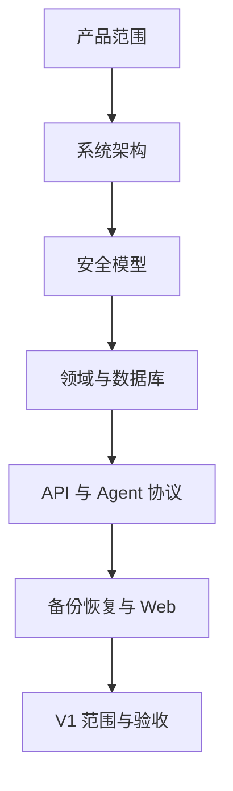

# RestFleet V1 Specification

本目录是 RestFleet V1 的规范来源。文档以“实现者无需补猜关键行为”为目标，涵盖产品、架构、安全、协议、数据、UI 与验收。

## 规范用语

- **MUST / 必须**：实现不可偏离。
- **MUST NOT / 禁止**：安全或兼容性硬约束。
- **SHOULD / 应当**：除非有已记录理由，否则应遵守。
- **MAY / 可以**：可选实现。

## 已锁定决策

| 项目 | V1 决策 |
|---|---|
| 产品名 | RestFleet |
| 产品形态 | 单租户、自托管、中心控制平面 + 多 Agent |
| Server / Gateway wrapper / Agent | Go |
| Web | React + TypeScript + Vite |
| 数据库 | PostgreSQL；不以 SQLite 作为生产控制面 |
| Agent 通道 | 出站 gRPC 双向流 + mTLS |
| Agent 调度 | 本地调度，保存 last-known-good 配置 |
| 存储桥接 | 中心运行 `rclone serve restic` |
| 默认 Repo 模型 | 一 Host 一 Repo |
| Agent Repo 权限 | 读取 + 新建对象；禁止删除和改写已有对象 |
| 维护权限 | 仅中心 Maintenance Worker |
| 中心部署 | Docker Compose |
| Agent 部署 | Native systemd（推荐）+ Docker |
| CPU 架构 | linux/amd64 + linux/arm64 |
| 时间 | 持久化 UTC；计划使用 IANA timezone |

## 关键事实

Restic 备份需要读取仓库元数据和索引，因此 `append-only` 不是“只能上传、完全不可读”。Agent 持有本仓库密码时，主机 root 被攻破者可读取该 Host 的历史快照。V1 的保护目标是：

1. 攻陷一台 Host 不能读取其他 Host 的仓库；
2. 攻陷一台 Host 不能删除或覆盖其历史备份；
3. 攻陷一台 Host 不能取得 rclone、OneDrive 或中心维护凭据。

## 文档关系

## 变更规则

- 修改安全不变量：必须同时更新 `AGENTS.md`、安全规范与相关验收测试。
- 修改对外 HTTP API：必须更新 OpenAPI、API 规范与契约测试。
- 修改 Agent 协议：必须说明向前/向后兼容窗口与滚动升级顺序。
- 修改数据库：必须提供可回滚或前向修复的迁移策略。
- 修改里程碑范围：必须更新 `IMPLEMENTATION_PLAN.md`。
